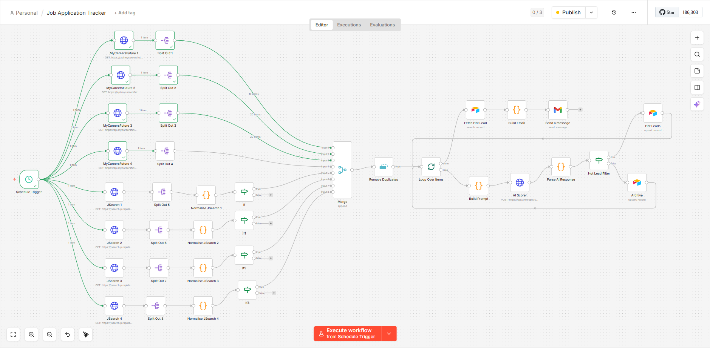
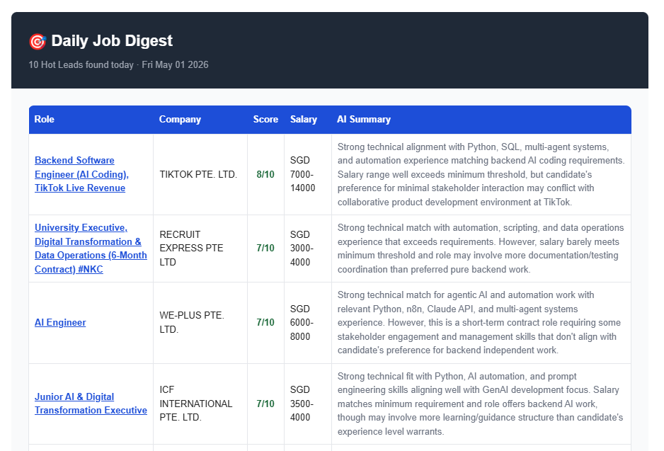

# AI-Powered Job Application Tracker

An automated job tracking system built with n8n that scrapes live job listings from multiple platforms, uses Claude AI to score each listing against a candidate profile, and organises results into an Airtable dashboard — running daily on a schedule with zero manual effort.

## What It Does

Most job seekers manually browse multiple platforms, copy listings into spreadsheets, and struggle to keep track of what's worth applying to. This workflow automates the entire discovery and triage process:

1. Scrapes 150+ job listings daily across multiple search terms from MyCareersFuture, LinkedIn, and JobStreet
2. Normalises data from different platforms into a unified structure
3. Removes duplicates across all sources using URL-based deduplication
4. Scores each job 1–10 using Claude AI based on skills match, role fit, red flags, and bonus criteria
5. Routes high-scoring jobs (7+) to a Hot Leads table and lower scores to Archive
6. Stores structured data including AI summary, missing skills, and red flags in Airtable
7. Sends a formatted HTML email digest of top-scored jobs daily via Gmail

## Screenshots

### Workflow Pipeline


### Daily Email Digest


## System Architecture

```
Schedule Trigger (daily)
        │
        ├── MyCareersFuture API (4 search terms)
        │   └── Split Out → Merge
        │
        ├── JSearch API via RapidAPI (4 search terms)
        │   └── Split Out → Normalise JSearch → Platform Filter → Merge
        │
        ▼
Merge (combine all sources)
        │
        ▼
Remove Duplicates (by jobDetailsUrl)
        │
        ▼
Loop Over Items (batch size: 1)
        │
        ▼
Build Prompt (Code node)
- Strips HTML from job description
- Extracts key fields (title, company, salary, skills, app count)
- Constructs structured scoring prompt with candidate profile
- Prepares clean API request body
        │
        ▼
AI Scorer (Claude API via HTTP Request)
- Scores job 1-10 against candidate profile
- Applies bonus points for specific AI tools
- Applies penalties for mismatched roles
- Applies minimum score override for primary AI tool roles
- Returns structured JSON
        │
        ▼
Parse AI Response (Code node)
- Extracts JSON from Claude response
- Handles malformed responses gracefully
- Merges AI results with original job data
        │
        ▼
Hot Lead Filter (If node: score >= 7)
├── True  → Airtable Hot Leads (Create or Update)
└── False → Airtable Archive (Create or Update)
        │
        ▼
Loop Over Items (done output — fires once after all jobs processed)
        │
        ▼
Fetch Hot Leads (Airtable — top 50 by fit score)
        │
        ▼
Build Email (Code node)
- Deduplicates by company (keeps highest scored role per company)
- Generates formatted HTML email table
- Shows top 10 unique companies
        │
        ▼
Gmail (sends daily digest)
```

## Data Sources

| Platform | Method | Search Terms |
|---|---|---|
| MyCareersFuture | Direct API | automation analyst, AI engineer, AI automation, process automation |
| LinkedIn | JSearch API (RapidAPI) | automation analyst, AI engineer, AI automation, process automation |
| JobStreet | JSearch API (RapidAPI) | automation analyst, AI engineer, AI automation, process automation |

JSearch also captures listings from other job boards (Indeed, Glassdoor, company career pages) as a bonus.

## AI Scoring Logic

The Claude API receives a structured prompt containing the candidate profile, job listing details, and explicit scoring rules.

### Scoring Rules

**Base score:** 1–10 based on overall fit

**Bonus points (added to base, max score 10):**
- +2 if role mentions any of: Anthropic API, Claude API, Claude Code, MCP, Model Context Protocol, RAG pipelines, prompt engineering, LangChain, n8n, Make.com as primary tools
- +1 if role requires 0–1 years experience or explicitly welcomes fresh graduates
- +1 if role is permanent (not contract)
- +1 if total applications are under 30

**Penalties (subtracted from base):**
- -3 if role is primarily IT helpdesk, infrastructure support, or network administration
- -2 if contract under 12 months
- -2 if salary ceiling is below SGD 4,000
- -2 if role requires 5+ years ML engineering or deep learning research
- -2 if role requires Java, .NET, or C# as primary language

**Minimum score override:**
If the role's PRIMARY responsibilities involve building with Anthropic API, Claude API, Claude Code, MCP, multi-agent systems, RAG pipelines, or prompt engineering, the minimum score is 7 — ensuring it always appears in Hot Leads for manual review. This override does NOT apply if these tools are mentioned only incidentally, as a single bullet point, or in a job title without being reflected in the actual responsibilities.

### Why contextual override matters
Generic terms like "agentic AI" or "AI workflows" appear in many unrelated roles. The override only triggers when the role's core work involves building with specific AI tools — distinguishing a genuine AI engineering role from a governance, sales, or management role that mentions AI in passing.

## Airtable Structure

### Hot Leads Table
Stores jobs scoring 7+ — roles actively worth considering.

| Field | Type | Description |
|---|---|---|
| job_title | Text | Role title |
| company | Text | Hiring company |
| platform | Text | Source (MyCareersFuture / JSearch) |
| url | URL | Direct link to listing |
| salary_range | Text | Salary from API |
| fit_score | Number | Claude's 1–10 score |
| missing_skills | Long text | Skills gaps identified |
| red_flags | Long text | Concerns flagged by AI |
| date_found | Date | Date scraped |
| status | Single select | New / Applied / Interviewing / Rejected |
| ai_summary | Long text | 2-sentence fit analysis |

### Archive Table
Same structure (minus status) for jobs scoring below 7.

## Daily Email Digest

The workflow sends one HTML email per day after all jobs are processed. The email:
- Shows top 10 unique roles (deduplicated by company)
- Sorted by fit score descending
- Includes role title, company, score, salary, and AI summary
- Links directly to each job listing

The email triggers from the Loop's "done" output — guaranteed to fire exactly once after all items are processed.

## Tech Stack

| Tool | Purpose |
|---|---|
| n8n | Workflow orchestration and automation |
| MyCareersFuture API | Live Singapore government job portal |
| JSearch API (RapidAPI) | LinkedIn, JobStreet and other platforms |
| Anthropic Claude API | AI job scoring and analysis |
| Airtable | Structured storage and tracking dashboard |
| Gmail | Daily HTML digest email |
| JavaScript (Code nodes) | Data transformation and prompt engineering |

## Key Design Decisions

**Why n8n instead of Python?**
n8n provides visual workflow orchestration that is easier to monitor, debug, and extend without touching code. Each node has a clear single responsibility, making the pipeline transparent and maintainable.

**Why Claude API for scoring instead of keyword matching?**
Keyword matching cannot reason about context. A job titled "Automation Analyst" might require Java test automation (wrong fit) or Python workflow automation (right fit). Claude reads the full description and makes a contextual judgement — the same way a human recruiter would.

**Why JSearch instead of direct scraping?**
LinkedIn and JobStreet actively block scraping. JSearch provides a clean API that handles anti-bot measures, returning structured data without brittle HTML parsing.

**Why URL-based deduplication?**
The same job listing often appears across multiple search terms (e.g. "AI Engineer" matching both "AI engineer" and "AI automation" searches). Using the job URL as the deduplication key catches these regardless of which search found them.

**Why upsert instead of create?**
The workflow runs daily. Using upsert means re-running the workflow updates existing records rather than creating duplicates. The tracker stays clean automatically.

**Why deduplicate by company in the email?**
Companies often post multiple similar roles. Showing one role per company in the email keeps the digest concise and actionable — the full list is always available in Airtable.

**Why "done" output for the email trigger?**
The loop's "done" output fires exactly once after all items are processed — guaranteed one email per run regardless of how many jobs were scored.

## Setup

### Prerequisites
- n8n instance (cloud or self-hosted)
- Anthropic API key (from console.anthropic.com)
- RapidAPI account with JSearch subscription (free tier: 200 requests/month)
- Airtable account with the base structure above
- Airtable Personal Access Token
- Gmail account connected to n8n

### Steps
1. Import the workflow JSON into n8n
2. Set up credentials:
   - Airtable Personal Access Token
   - Anthropic API key (as Header Auth: `x-api-key`)
   - RapidAPI key (as Header Auth for JSearch nodes)
   - Gmail OAuth2
3. Update Airtable Base ID and Table names
4. Activate the Schedule Trigger for daily runs
5. Run manually first to verify the pipeline end to end

### Customising the Candidate Profile

In the **Build Prompt** code node, update the candidate profile section:

```javascript
content: `...
CANDIDATE PROFILE:
Skills: your skills here
Preferences: your work preferences here
Minimum acceptable salary: SGD XXXX
...`
```

Update the search terms in each HTTP Request node to match your target roles.

## Limitations and Future Improvements

- JSearch free tier limited to 200 requests/month — paid tier needed for higher volume
- AI scoring accuracy ~85-90% — manual review of borderline scores (6-7) recommended
- Salary data often missing from JSearch results (LinkedIn/JobStreet don't always expose it)
- Future: Slack notification when a score 9+ job is found
- Future: Auto-generate tailored cover letter draft for Hot Leads
- Future: Track application outcomes to improve scoring over time

## Author

Yuen Wei Ling — [GitHub](https://github.com/eyyuen) | [LinkedIn](https://www.linkedin.com/in/wei-ling-y-73b88122a/) | Singapore
